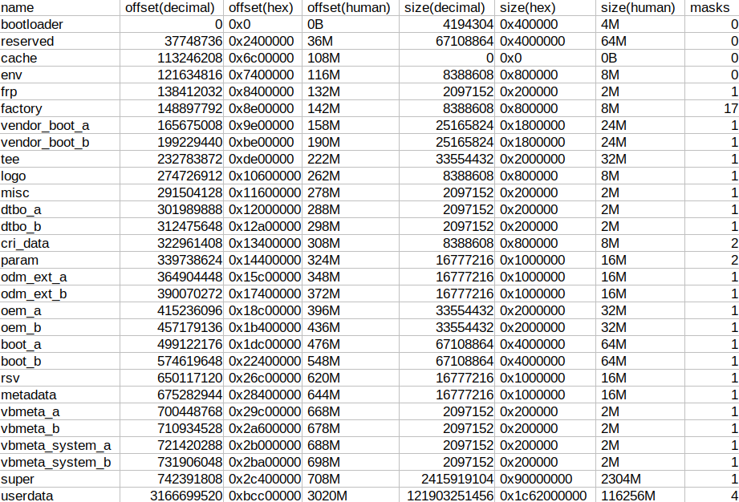

# Emulate eMMC with only DTB

In some cases (e.g. where you need to reverse-engineer an Android box's partition layout, on which you can not boot a Linux distro and have to use the stock Android, and can't dump the whole eMMC, but you can still get its DTB from its firmware), to emulate an eMMC dump and generate EPT on it with the DTB is a good idead to get the EPT

## Getting the exact size of the actual eMMC
If you can access the sysfs on the box, you can obtain the sectors of the corresponding block device:
```
cat /sys/block/your_eMMC_block_device/size
```
This can give you the sector account, with which you should multiply 512 to get the size in Byte.

Or if you can take the box apart, you could identify the eMMC chip's model, and search its info online. The technical documentation would contain the byte-correct size for the user area (those except addtional ``boot0``, ``boot1``, ``rpmb``).

Or if you can't do both, then based on the eMMC capacity labeled by the vendor, you can guess its size from the existing data of devices in my hand:

|size|name|make|hex|human|diff|
|-|-|-|-|-|-|
|8G|008G30|Toshiba|1d2000000|7456M|8G-736M|
|16G|AJTD4R|Samsung|3a3e00000|14910M|16G-1474M|
|32G|?|?|747c00000|29820M|32G-2948M|
|128G|DUTA32|Samsung|1d1ec0000|119276M|128G-11796M

If exact partition size for the last partition is not required (which is actually usually the case, the last partition ``data``/``userdata`` usually has a size ``-1`` in DTB, and will be mapped to a partition that occupies all the remaining spaces in eMMC. You don't neccessarrily need its exact size if all you want are the partition infos for those at the beginning), you can just YOLO it and use a guessed number (e.g. 30G for a 32G eMMC)

## Create an empty file with the same size
If your fs supports ``truncate``, you can create an empty file like this:
```
truncate -s 119276M fake_emmc.img
```
You can also create the file with ``dd``:
```
dd if=/dev/null of=fake_emmc.img bs=1M count=119276M
```

## Inject DTB into fake eMMC

The Android DTBs on Amlogic devices are stored at 4M offset in the reserved partition, which then is placed at 36M offset in the eMMC, so DTB is stored at 36M+4M=40M offset in the eMMC. 

Writing your DTB to 40M offset so ampart can read it:
```
dd if=your_dtb.dtb of=fake_emmc.img bs=1M seek=40 conv=notrunc
```
``notrunc`` is required, otherwise the part after the DTB will be removed

## Check ampart recognizes the fake eMMC
If your operation is correct, ampart would now identify the file as a dump for a whole eMMC, with valid DTB and an empty EPT (eMMC partition table). Running ``ampart`` with only the file as argument:
```
ampart fake_emmc.img
```
Would report the partitions in DTB:
```
DTS report partitions: 25 partitions in the DTB:
=======================================================
ID| name            |            size|(   human)| masks
-------------------------------------------------------
 0: frp                        200000 (   2.00M)      1
 1: factory                    800000 (   8.00M)     17
 2: vendor_boot_a             1800000 (  24.00M)      1
 3: vendor_boot_b             1800000 (  24.00M)      1
 4: tee                       2000000 (  32.00M)      1
 5: logo                       800000 (   8.00M)      1
 6: misc                       200000 (   2.00M)      1
 7: dtbo_a                     200000 (   2.00M)      1
 8: dtbo_b                     200000 (   2.00M)      1
 9: cri_data                   800000 (   8.00M)      2
10: param                     1000000 (  16.00M)      2
11: odm_ext_a                 1000000 (  16.00M)      1
12: odm_ext_b                 1000000 (  16.00M)      1
13: oem_a                     2000000 (  32.00M)      1
14: oem_b                     2000000 (  32.00M)      1
15: boot_a                    4000000 (  64.00M)      1
16: boot_b                    4000000 (  64.00M)      1
17: rsv                       1000000 (  16.00M)      1
18: metadata                  1000000 (  16.00M)      1
19: vbmeta_a                   200000 (   2.00M)      1
20: vbmeta_b                   200000 (   2.00M)      1
21: vbmeta_system_a            200000 (   2.00M)      1
22: vbmeta_system_b            200000 (   2.00M)      1
23: super                    90000000 (   2.25G)      1
24: userdata                          (AUTOFILL)      4
=======================================================
```
And an empty EPT:
```
EPT report: 0 partitions in the table:
===================================================================================
ID| name            |          offset|(   human)|            size|(   human)| masks
-----------------------------------------------------------------------------------
===================================================================================
```

## Generate EPT from DTB
The ``dtoe`` mode in ampart can generate EPT (eMMC partition table) from the existing DTB in the same way Amlogic's u-boot would do it. With a command like this:
```
ampart fake_emmc.img  --mode dtoe
```

The EPT will be genrated:
```
EPT report: 29 partitions in the table:
===================================================================================
ID| name            |          offset|(   human)|            size|(   human)| masks
-----------------------------------------------------------------------------------
 0: bootloader                      0 (   0.00B)           400000 (   4.00M)      0
    (GAP)                                                 2000000 (  32.00M)
 1: reserved                  2400000 (  36.00M)          4000000 (  64.00M)      0
    (GAP)                                                  800000 (   8.00M)
 2: cache                     6c00000 ( 108.00M)                0 (   0.00B)      0
    (GAP)                                                  800000 (   8.00M)
 3: env                       7400000 ( 116.00M)           800000 (   8.00M)      0
    (GAP)                                                  800000 (   8.00M)
 4: frp                       8400000 ( 132.00M)           200000 (   2.00M)      1
    (GAP)                                                  800000 (   8.00M)
 5: factory                   8e00000 ( 142.00M)           800000 (   8.00M)     17
    (GAP)                                                  800000 (   8.00M)
 6: vendor_boot_a             9e00000 ( 158.00M)          1800000 (  24.00M)      1
    (GAP)                                                  800000 (   8.00M)
 7: vendor_boot_b             be00000 ( 190.00M)          1800000 (  24.00M)      1
    (GAP)                                                  800000 (   8.00M)
 8: tee                       de00000 ( 222.00M)          2000000 (  32.00M)      1
    (GAP)                                                  800000 (   8.00M)
 9: logo                     10600000 ( 262.00M)           800000 (   8.00M)      1
    (GAP)                                                  800000 (   8.00M)
10: misc                     11600000 ( 278.00M)           200000 (   2.00M)      1
    (GAP)                                                  800000 (   8.00M)
11: dtbo_a                   12000000 ( 288.00M)           200000 (   2.00M)      1
    (GAP)                                                  800000 (   8.00M)
12: dtbo_b                   12a00000 ( 298.00M)           200000 (   2.00M)      1
    (GAP)                                                  800000 (   8.00M)
13: cri_data                 13400000 ( 308.00M)           800000 (   8.00M)      2
    (GAP)                                                  800000 (   8.00M)
14: param                    14400000 ( 324.00M)          1000000 (  16.00M)      2
    (GAP)                                                  800000 (   8.00M)
15: odm_ext_a                15c00000 ( 348.00M)          1000000 (  16.00M)      1
    (GAP)                                                  800000 (   8.00M)
16: odm_ext_b                17400000 ( 372.00M)          1000000 (  16.00M)      1
    (GAP)                                                  800000 (   8.00M)
17: oem_a                    18c00000 ( 396.00M)          2000000 (  32.00M)      1
    (GAP)                                                  800000 (   8.00M)
18: oem_b                    1b400000 ( 436.00M)          2000000 (  32.00M)      1
    (GAP)                                                  800000 (   8.00M)
19: boot_a                   1dc00000 ( 476.00M)          4000000 (  64.00M)      1
    (GAP)                                                  800000 (   8.00M)
20: boot_b                   22400000 ( 548.00M)          4000000 (  64.00M)      1
    (GAP)                                                  800000 (   8.00M)
21: rsv                      26c00000 ( 620.00M)          1000000 (  16.00M)      1
    (GAP)                                                  800000 (   8.00M)
22: metadata                 28400000 ( 644.00M)          1000000 (  16.00M)      1
    (GAP)                                                  800000 (   8.00M)
23: vbmeta_a                 29c00000 ( 668.00M)           200000 (   2.00M)      1
    (GAP)                                                  800000 (   8.00M)
24: vbmeta_b                 2a600000 ( 678.00M)           200000 (   2.00M)      1
    (GAP)                                                  800000 (   8.00M)
25: vbmeta_system_a          2b000000 ( 688.00M)           200000 (   2.00M)      1
    (GAP)                                                  800000 (   8.00M)
26: vbmeta_system_b          2ba00000 ( 698.00M)           200000 (   2.00M)      1
    (GAP)                                                  800000 (   8.00M)
27: super                    2c400000 ( 708.00M)         90000000 (   2.25G)      1
    (GAP)                                                  800000 (   8.00M)
28: userdata                 bcc00000 (   2.95G)       1c62000000 ( 113.53G)      4
===================================================================================
```
which will be 100% the same as the EPT on the actual device.

## Get snapshots of the new EPT
If you have a script that'll do some logic depending on the layout, or want to create a nicer table with the data, the above table might be hard to parse. You can use ampart's ``esnapshot`` mode to get the snapshot of the table. ampart will always print the logs to stderr and snapshots to stdout.

A command like this:
```
ampart fake_emmc.img  --mode esnapshot
```
Will get you three snapshots on stdout, one per line. Each with the partitions seperated by space, and then in each partition, infos (name, offset, size, masks) seperated by :

The first one uses decimal integer for offset and size, and is friendly for those script that want to get the number to do calculation. More recommended for an external script written in ``bash``
```
bootloader:0:4194304:0 reserved:37748736:67108864:0 cache:113246208:0:0 env:121634816:8388608:0 frp:138412032:2097152:1 factory:148897792:8388608:17 vendor_boot_a:165675008:25165824:1 vendor_boot_b:199229440:25165824:1 tee:232783872:33554432:1 logo:274726912:8388608:1 misc:291504128:2097152:1 dtbo_a:301989888:2097152:1 dtbo_b:312475648:2097152:1 cri_data:322961408:8388608:2 param:339738624:16777216:2 odm_ext_a:364904448:16777216:1 odm_ext_b:390070272:16777216:1 oem_a:415236096:33554432:1 oem_b:457179136:33554432:1 boot_a:499122176:67108864:1 boot_b:574619648:67108864:1 rsv:650117120:16777216:1 metadata:675282944:16777216:1 vbmeta_a:700448768:2097152:1 vbmeta_b:710934528:2097152:1 vbmeta_system_a:721420288:2097152:1 vbmeta_system_b:731906048:2097152:1 super:742391808:2415919104:1 userdata:3166699520:121903251456:4
```
The second one uses hex-decimal integer for offset and size, and is friendly for those scripts that want to get the number to do calculation, it's also nicer to look. More recommended for an external script written in ``python``
```
bootloader:0x0:0x400000:0 reserved:0x2400000:0x4000000:0 cache:0x6c00000:0x0:0 env:0x7400000:0x800000:0 frp:0x8400000:0x200000:1 factory:0x8e00000:0x800000:17 vendor_boot_a:0x9e00000:0x1800000:1 vendor_boot_b:0xbe00000:0x1800000:1 tee:0xde00000:0x2000000:1 logo:0x10600000:0x800000:1 misc:0x11600000:0x200000:1 dtbo_a:0x12000000:0x200000:1 dtbo_b:0x12a00000:0x200000:1 cri_data:0x13400000:0x800000:2 param:0x14400000:0x1000000:2 odm_ext_a:0x15c00000:0x1000000:1 odm_ext_b:0x17400000:0x1000000:1 oem_a:0x18c00000:0x2000000:1 oem_b:0x1b400000:0x2000000:1 boot_a:0x1dc00000:0x4000000:1 boot_b:0x22400000:0x4000000:1 rsv:0x26c00000:0x1000000:1 metadata:0x28400000:0x1000000:1 vbmeta_a:0x29c00000:0x200000:1 vbmeta_b:0x2a600000:0x200000:1 vbmeta_system_a:0x2b000000:0x200000:1 vbmeta_system_b:0x2ba00000:0x200000:1 super:0x2c400000:0x90000000:1 userdata:0xbcc00000:0x1c62000000:4
```
The third one uses human-readable interger + suffix for offset and size. It is hard for scripts to parse but easy to record, and better suited for users if they want to check the result. More recommended for reporting and demo usage
```
bootloader:0B:4M:0 reserved:36M:64M:0 cache:108M:0B:0 env:116M:8M:0 frp:132M:2M:1 factory:142M:8M:17 vendor_boot_a:158M:24M:1 vendor_boot_b:190M:24M:1 tee:222M:32M:1 logo:262M:8M:1 misc:278M:2M:1 dtbo_a:288M:2M:1 dtbo_b:298M:2M:1 cri_data:308M:8M:2 param:324M:16M:2 odm_ext_a:348M:16M:1 odm_ext_b:372M:16M:1 oem_a:396M:32M:1 oem_b:436M:32M:1 boot_a:476M:64M:1 boot_b:548M:64M:1 rsv:620M:16M:1 metadata:644M:16M:1 vbmeta_a:668M:2M:1 vbmeta_b:678M:2M:1 vbmeta_system_a:688M:2M:1 vbmeta_system_b:698M:2M:1 super:708M:2304M:1 userdata:3020M:116256M:4
```

With the following script you can generate a ``result.csv`` table from ampart's snapshot:
```
log="$(ampart --mode esnapshot fake_emmc.img 2>/dev/null)"
readarray -d $'\n' -t snapshots <<< "${log}"
partitions_decimal=(${snapshots[0]})
partitions_hex=(${snapshots[1]})
partitions_human=(${snapshots[2]})
echo 'name, offset(decimal), offset(hex), offset(human), size(decimal), size(hex), size(human), masks' > 'result.csv'
for i in $(seq 0 $((${#partitions_decimal[@]} - 1))); do
    readarray -d ':' -t partinfo_decimal < <(printf '%s' "${partitions_decimal[i]}")
    readarray -d ':' -t partinfo_hex < <(printf '%s' "${partitions_hex[i]}")
    readarray -d ':' -t partinfo_human < <(printf '%s' "${partitions_human[i]}")
    echo "${partinfo_decimal[0]}, ${partinfo_decimal[1]}, ${partinfo_hex[1]}, ${partinfo_human[1]}, ${partinfo_decimal[2]}, ${partinfo_hex[2]}, ${partinfo_human[2]}, ${partinfo_decimal[3]}" >> 'result.csv'
done
```
The result .csv file:


