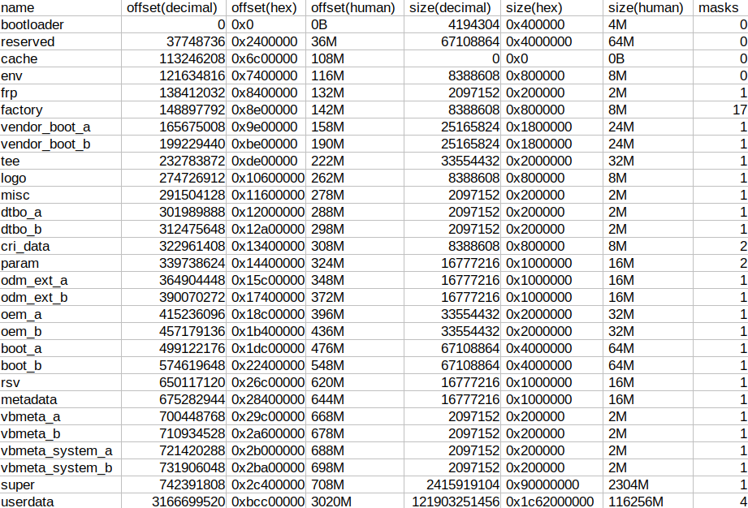

# Scripting: Create CSV table from snapshot

Documentation for demo script [csv-table-from-snapshot](../scripts/csv-table-from-snapshot.sh)

A command like this:
```
ampart emmc.img  --mode esnapshot
```
Will get you three snapshots on stdout, one per line (seperated by new-line `\n`). Each with the partitions seperated by space (` `), and then in each partition, infos (name, offset, size, masks) seperated by colon (`:`)

The first one uses decimal integer for offset and size, and is friendly for those scripts that want to get the number to do some calculation. It is more recommended for an external script written in ``bash``
```
bootloader:0:4194304:0 reserved:37748736:67108864:0 cache:113246208:0:0 env:121634816:8388608:0 frp:138412032:2097152:1 factory:148897792:8388608:17 vendor_boot_a:165675008:25165824:1 vendor_boot_b:199229440:25165824:1 tee:232783872:33554432:1 logo:274726912:8388608:1 misc:291504128:2097152:1 dtbo_a:301989888:2097152:1 dtbo_b:312475648:2097152:1 cri_data:322961408:8388608:2 param:339738624:16777216:2 odm_ext_a:364904448:16777216:1 odm_ext_b:390070272:16777216:1 oem_a:415236096:33554432:1 oem_b:457179136:33554432:1 boot_a:499122176:67108864:1 boot_b:574619648:67108864:1 rsv:650117120:16777216:1 metadata:675282944:16777216:1 vbmeta_a:700448768:2097152:1 vbmeta_b:710934528:2097152:1 vbmeta_system_a:721420288:2097152:1 vbmeta_system_b:731906048:2097152:1 super:742391808:2415919104:1 userdata:3166699520:121903251456:4
```
The second one uses hex-decimal integer for offset and size, and is friendly for those scripts that want to get the number to do some calculation, it's also nicer to look. It is more recommended for an external script written in ``python``
```
bootloader:0x0:0x400000:0 reserved:0x2400000:0x4000000:0 cache:0x6c00000:0x0:0 env:0x7400000:0x800000:0 frp:0x8400000:0x200000:1 factory:0x8e00000:0x800000:17 vendor_boot_a:0x9e00000:0x1800000:1 vendor_boot_b:0xbe00000:0x1800000:1 tee:0xde00000:0x2000000:1 logo:0x10600000:0x800000:1 misc:0x11600000:0x200000:1 dtbo_a:0x12000000:0x200000:1 dtbo_b:0x12a00000:0x200000:1 cri_data:0x13400000:0x800000:2 param:0x14400000:0x1000000:2 odm_ext_a:0x15c00000:0x1000000:1 odm_ext_b:0x17400000:0x1000000:1 oem_a:0x18c00000:0x2000000:1 oem_b:0x1b400000:0x2000000:1 boot_a:0x1dc00000:0x4000000:1 boot_b:0x22400000:0x4000000:1 rsv:0x26c00000:0x1000000:1 metadata:0x28400000:0x1000000:1 vbmeta_a:0x29c00000:0x200000:1 vbmeta_b:0x2a600000:0x200000:1 vbmeta_system_a:0x2b000000:0x200000:1 vbmeta_system_b:0x2ba00000:0x200000:1 super:0x2c400000:0x90000000:1 userdata:0xbcc00000:0x1c62000000:4
```
The third one uses human-readable interger + suffix for offset and size. It is hard for scripts to parse but easy to record, and better suited for users if they want to check the result. It is more recommended for reporting and demo usage
```
bootloader:0B:4M:0 reserved:36M:64M:0 cache:108M:0B:0 env:116M:8M:0 frp:132M:2M:1 factory:142M:8M:17 vendor_boot_a:158M:24M:1 vendor_boot_b:190M:24M:1 tee:222M:32M:1 logo:262M:8M:1 misc:278M:2M:1 dtbo_a:288M:2M:1 dtbo_b:298M:2M:1 cri_data:308M:8M:2 param:324M:16M:2 odm_ext_a:348M:16M:1 odm_ext_b:372M:16M:1 oem_a:396M:32M:1 oem_b:436M:32M:1 boot_a:476M:64M:1 boot_b:548M:64M:1 rsv:620M:16M:1 metadata:644M:16M:1 vbmeta_a:668M:2M:1 vbmeta_b:678M:2M:1 vbmeta_system_a:688M:2M:1 vbmeta_system_b:698M:2M:1 super:708M:2304M:1 userdata:3020M:116256M:4
```
The result .csv file:

